# Konten Slide Design System (Diagram & Arsitektur)

Slide ini meminta gambaran visual sistem. Karena saya adalah AI berbasis teks, saya buatkan **Kode Diagram (Mermaid)** yang bisa kamu *copy-paste* ke [Mermaid Live Editor](https://mermaid.live/) untuk diubah menjadi gambar diagram yang bagus, atau langsung gunakan deskripsinya.

---

## 1. Diagram Use Case (Interaksi Pengguna)
*Menggambarkan apa yang bisa dilakukan oleh Admin dan Pelanggan.*

```mermaid
usecaseDiagram
    actor "Pelanggan" as U
    actor "Admin" as A

    package "Website Seblak Umi" {
        usecase "Register & Login" as UC1
        usecase "Lihat Menu & Kategori" as UC2
        usecase "Pesan Seblak (Checkout)" as UC3
        usecase "Bayar Online (Midtrans)" as UC4
        usecase "Beri Testimoni" as UC5
        
        usecase "Kelola Produk (CRUD)" as UC6
        usecase "Kelola Pesanan" as UC7
        usecase "Lihat Laporan Penjualan" as UC8
    }

    U --> UC1
    U --> UC2
    U --> UC3
    U --> UC4
    U --> UC5

    A --> UC1
    A --> UC6
    A --> UC7
    A --> UC8
```

---

## 2. Entity Relationship Diagram (ERD)
*Menggambarkan struktur database dan relasi antar tabel.*

```mermaid
erDiagram
    USERS ||--o{ ORDERS : "melakukan"
    USERS ||--o{ TESTIMONIALS : "menulis"
    CATEGORIES ||--o{ PRODUCTS : "memiliki"
    PRODUCTS ||--o{ ORDER_ITEMS : "terdapat di"
    ORDERS ||--|{ ORDER_ITEMS : "berisi"
    ORDERS ||--|| PAYMENTS : "memiliki"

    USERS {
        int id
        string name
        string email
        string role "admin/user"
    }

    PRODUCTS {
        int id
        string name
        int price
        int stock
        string image
    }

    ORDERS {
        int id
        int user_id
        int total_price
        string status "pending/paid"
    }

    PAYMENTS {
        int id
        int order_id
        string transaction_status
        string payment_type
    }
```



---

## 3. Arsitektur Sistem (Alur Kerja)
*Menjelaskan bagaimana komponen Frontend, Backend, dan Database terhubung.*

**Penjelasan Singkat untuk Slide:**
"Sistem menggunakan arsitektur **Client-Server**. Pengguna mengakses antarmuka **Frontend (Blade & Tailwind)** melalui browser. Permintaan diproses oleh **Backend (Laravel)** yang menangani logika bisnis dan keamanan. Data disimpan dan diambil dari **Database (MySQL)**, sementara pembayaran diproses melalui API eksternal **Midtrans**."

**Visualisasi Arsitektur:**

