# Cara Membuat Use Case Diagram untuk Website Seblak Umi

## Langkah 1: Buka Website
Buka browser dan kunjungi: **https://mermaid.live/**

## Langkah 2: Hapus Kode Default
Di bagian "Code", hapus semua kode yang ada dan ganti dengan kode di bawah ini.

## Langkah 3: Copy-Paste Kode Ini

```mermaid
graph TB
    %% Actors
    Pelanggan((Pelanggan))
    Admin((Admin))
    
    %% Use Cases - Pelanggan
    UC1[Register & Login]
    UC2[Lihat Menu Produk]
    UC3[Tambah ke Keranjang]
    UC4[Checkout Pesanan]
    UC5[Upload Bukti Bayar]
    UC6[Lihat Status Pesanan]
    UC7[Beri Testimoni]
    
    %% Use Cases - Admin
    UC8[Kelola Produk CRUD]
    UC9[Kelola Kategori]
    UC10[Lihat Pesanan Masuk]
    UC11[Konfirmasi Pembayaran]
    UC12[Kelola Testimoni]
    UC13[Lihat Laporan Penjualan]
    UC14[Export Laporan PDF/Excel]
    
    %% Connections Pelanggan
    Pelanggan --> UC1
    Pelanggan --> UC2
    Pelanggan --> UC3
    Pelanggan --> UC4
    Pelanggan --> UC5
    Pelanggan --> UC6
    Pelanggan --> UC7
    
    %% Connections Admin
    Admin --> UC1
    Admin --> UC8
    Admin --> UC9
    Admin --> UC10
    Admin --> UC11
    Admin --> UC12
    Admin --> UC13
    Admin --> UC14
    
    %% Styling
    classDef actor fill:#4A90E2,stroke:#2E5C8A,stroke-width:2px,color:#fff
    classDef usecase fill:#50C878,stroke:#2E7D4E,stroke-width:2px,color:#fff
    
    class Pelanggan,Admin actor
    class UC1,UC2,UC3,UC4,UC5,UC6,UC7,UC8,UC9,UC10,UC11,UC12,UC13,UC14 usecase
```

## Langkah 4: Lihat Hasilnya
Diagram akan otomatis muncul di sebelah kanan. Kamu bisa:
- **Download PNG**: Klik tombol download untuk simpan sebagai gambar
- **Copy SVG**: Untuk kualitas lebih bagus
- **Edit**: Ubah teks sesuai kebutuhan

## Tips:
- Ganti nama use case sesuai fitur websitemu
- Tambah atau kurangi fitur dengan menambah/menghapus baris UC
- Warna bisa diubah di bagian `classDef`
